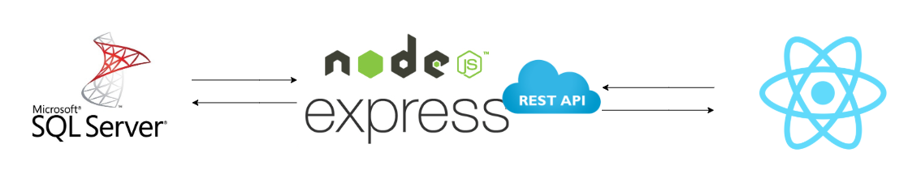
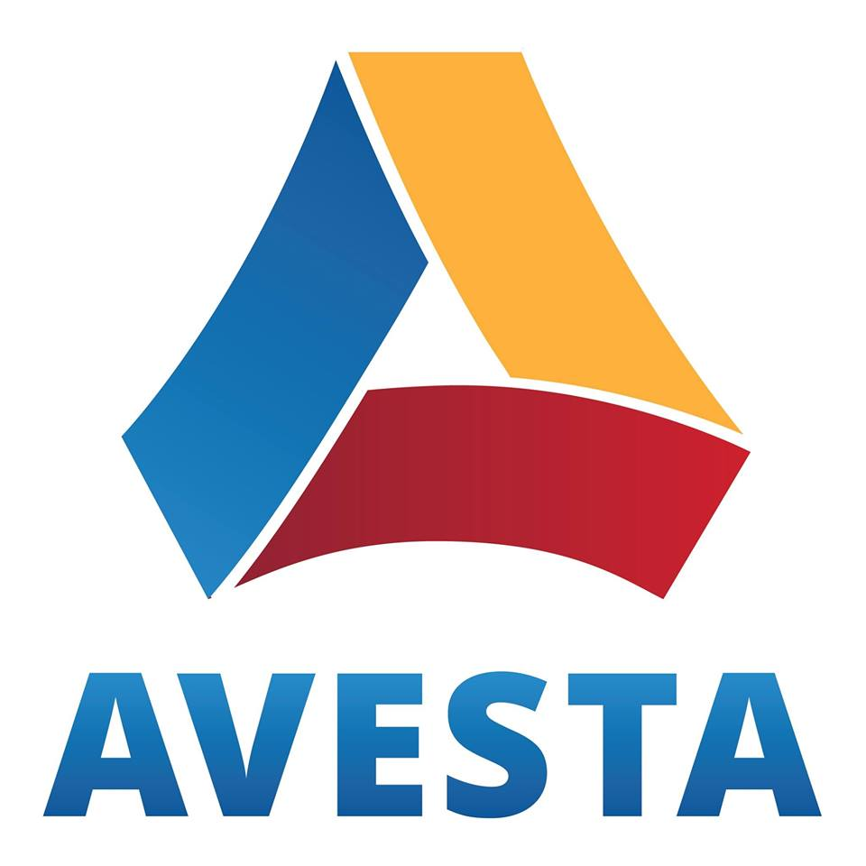
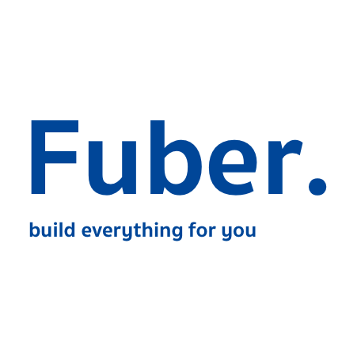

<h1>TechUbon meetup 1.0 : 03-02-19</h1>
<h2>Mini workshop : SQL server , Nodejs , React</h2>

    

<h2>Utility CSS</h2>

    

<h2>Schedule</h2>

    <table style="width:100%">
        <tr>
            <th>Start time</th>
            <th>Topic</th>
            <th>Speaker</th>
        </tr>
        <tr>
            <td>10.00 - 11.00</td>
            <td>SQL server</td>
            <td>
                
                Paramat Singkon
            </td>
        </tr>
        <tr>
            <td>11.00 - 12.00</td>
            <td>Nodejs</td>
            <td>
                
                Jirayuth Sing-ngam
            </td>
        </tr>
        <tr>
            <td>13.30 - 14.30</td>
            <td>React</td>
            <td>
                
                Nuttawat Sritunyarat
            </td>
        </tr>
        <tr>
            <td>14.30 - 15.30</td>
            <td>Utility CSS</td>
            <td>
                
                Thanapong Prathumchat
            </td>
        </tr>
    </table>

<h2>Place at YUU HOTEL & Cafe </h2>

<h2>Requirement for workshop</h2>
<ul>
    <li>Your labtop MacOs/Window/Linux</li>
    <li>install Node >= version 6</li>
    <li>npm >= version 5.2</li>
    <li>Docker</li>
    <li>Azure data studio</li>
    <li>Visual studio code</li>
</ul>
<h2>
Support by
</h2>

    
    
    
    

